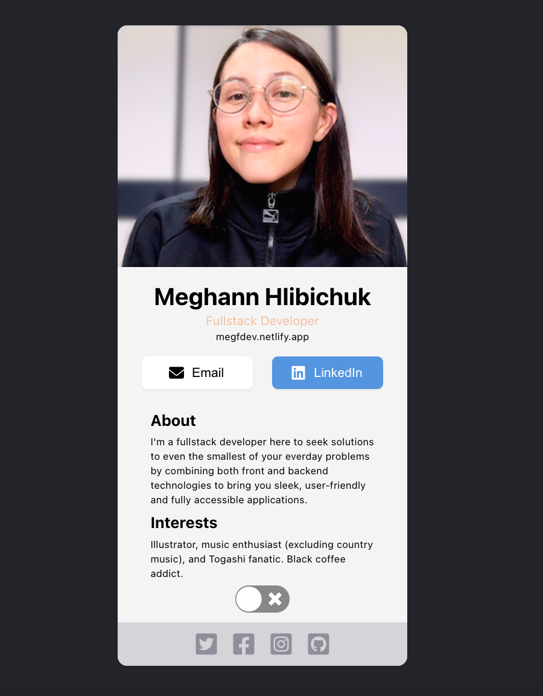
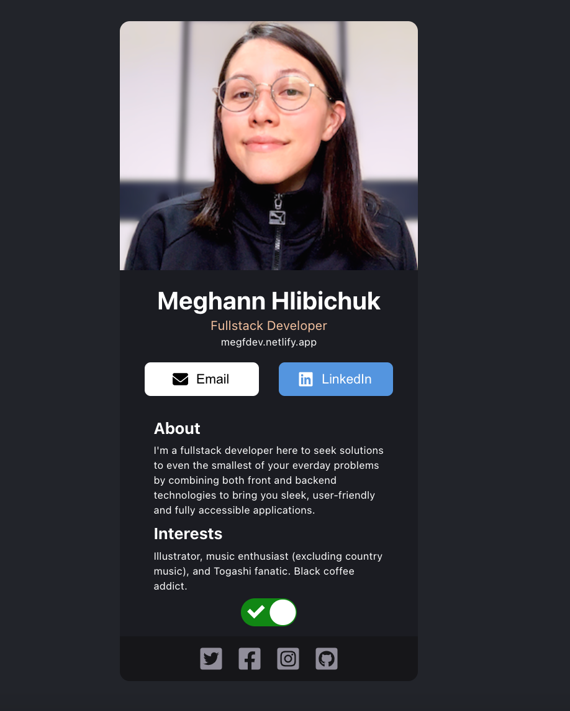

# React.js Profile Card

This mini project was made with React and CSS as part of Scrimba's first React project.

# Building

Throughout the building of this project, Brad Traversy's React Crash Course was an invaluable resource and referred back to it several times.
I understood the basics of the useState hook and was able to utilize it to excute the button hover functionality and the dark/light mode toggle.
I was also able to acquire a better understanding of props and how they allow you to customize certain properties of the same type of component.

|light mode|dark mode|
|:-:|:-:|
||

